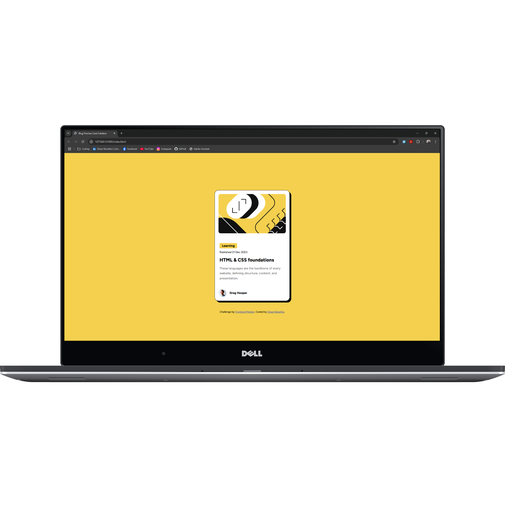
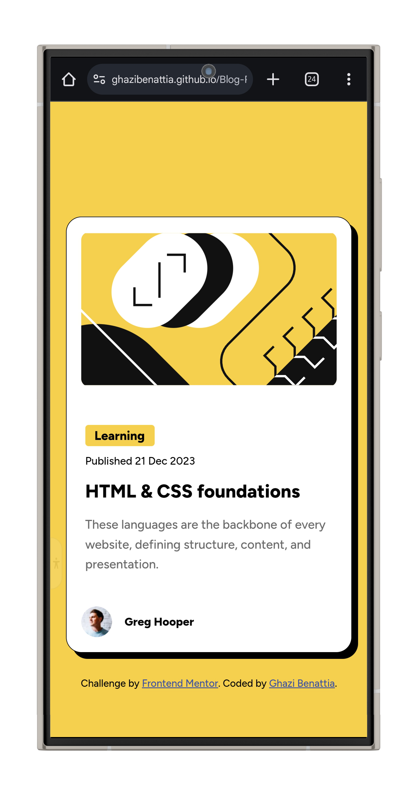
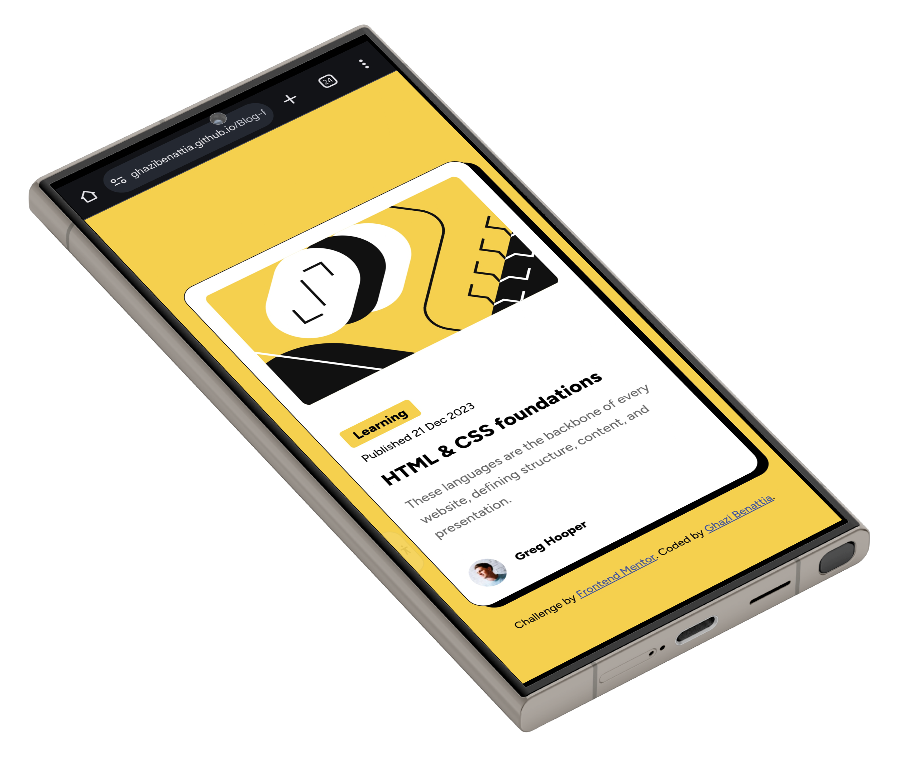

# Frontend Mentor - QR code component solution by Ghazi Benattia
This is a solution to the [Blog Preview Card Challenge](https://www.frontendmentor.io/challenges/blog-preview-card-ckPaj01IcS). 
Frontend Mentor challenges help you improve your coding skills by building realistic projects. 
***
## Table of contents
- [Overview](#overview)
  - [Screenshots](#screenshots)
  - [Links](#links)
- [My process](#my-process)
  - [Built with](#built-with)
  - [What I learned](#what-i-learned)
  - [Continued development](#continued-development)
  - [Useful resources](#useful-resources)
- [Author](#author)
- [Acknowledgments](#acknowledgments)
***
## Overview
Here's my solution to the Blog preview card challenge on FrontEnd Mentor.
***
### Screenshots
- How the website looks like in your laptop browser:

- Multiple phone design of the website:


---

### Links
- Solution URL: [Github repository](https://github.com/ghazibenattia/Blog-Preview-Card-Challenge-Solution)
- Live Site URL: [Live site using Github pages](https://ghazibenattia.github.io/Blog-Preview-Card-Challenge-Solution/)

---
## My process
For the last challenge, I created a blog preview card website to practice my frontend skills. I started by working with HTML5 and CSS, focusing on a clean and responsive layout. My goal was to design a card that displayed an image, a blog title, a short description, and author details in a visually appealing way. I used Flexbox to structure the layout and ensure the elements were centered and aligned properly. I also incorporated a yellow background label for the blog category and a hover effect on the title to add interactivity. As I was still learning, I paid close attention to the details, such as removing the default underline from the title and making the layout mobile-friendly using media queries. Overall, this project was an excellent opportunity to apply responsive design techniques and improve my understanding of CSS, especially Flexbox and hover effects.

---
### Built with
- **Technologies and languages:**
    - **HTML5:** Used to structure the content of the webpage, including the card layout, image, text, and author details.
    - **CSS3:** Used for styling the page and the card, including typography, color schemes, and layout techniques.
- **Techniques:**
   - **Flexbox:** Used for the flexible layout of elements inside the card, such as centering the image and aligning the text and avatar containers.
   - **Responsive Design:** Ensured the design adjusts properly on smaller screens using media queries, such as resizing the card width and adjusting the image size.
   - **Hover Effects:** Implemented smooth hover effects for the blog post title, changing the color when hovered over.
   - **Object Fit:** Used **object-fit: cover** on images to ensure they maintain their aspect ratio while filling their containers.
   - **Box Shadow and Border Radius:** Applied for visual styling of the card, creating a subtle shadow and rounded corners.
   - **Font Styling:** Integrated Google Fonts (Figtree) to enhance typography and maintain a clean, modern look.
   - **Margin and Padding Adjustments:** Fine-tuned spacing between elements for a well-balanced, neat layout.
 
---

### What I learned
Working on this project has helped me develop a deeper understanding of front-end development. One key skill I learned is how to structure a responsive layout using Flexbox, which ensures the card adapts to different screen sizes. I also improved my proficiency with CSS techniques like creating hover effects, controlling spacing using margins and padding, and applying transitions for smoother user interactions. Additionally, I got better at optimizing the use of media queries to ensure my design is mobile-friendly. The experience from my previous QR code component challenge also helped me build a solid foundation in HTML and CSS, giving me the confidence to tackle this more complex layout. Through trial and error, I enhanced my ability to troubleshoot and refine code for better visual appeal and functionality.

### Code snippets
These code snippets below highlight key techniques such as Flexbox, responsive design, custom fonts, hover effects, and more, which I used to build a clean, responsive, and visually appealing blog preview card.
**1.** **Custom font from Google Fonts:**
```html
<link href="https://fonts.googleapis.com/css2?family=Figtree:wght@500;800&display=swap" rel="stylesheet">
```
**To enhance the typography, I linked an external font ("Figtree") from Google Fonts and applied it globally across the site, ensuring a modern and clean look.**

---
**2.** **Flexbox for Layout:**
```css
#preview-card-container {
    display: flex;
    flex-direction: column;
    justify-content: space-between;
}
```
**I used Flexbox to create a flexible layout for the blog preview card. By setting *"flex-direction: column"*, the elements inside the card are stacked vertically, and *justify-content: space-between* ensures the content is spaced out evenly.**

---
**3.** **Responsive Design with Media Queries:**
```css
@media screen and (max-width: 500px) {
    #preview-card-container {
        width: 90%;
    }

    .preview-card-img img {
        width: 100%;
        height: auto;
    }
}
```
**I applied media queries to make the design responsive. When the screen width is 500px or smaller, the card width adjusts to 90% of the screen, and the image’s height is automatically adjusted to maintain its aspect ratio.**

---
**4.** **Border Radius for Rounded Corners:**
```css
#preview-card-container {
    border-radius: 20px;
}
.preview-card-img img {
    border-radius: 10px;
}
```
**I used *"border-radius"* to round the corners of the blog preview card and the image inside it, giving the design a more polished and modern appearance.**

---
**5.** **Box Shadow for Depth:**
```css
#preview-card-container {
    box-shadow: 8px 8px 0px 0px hsl(0, 0%, 0%);
}
```
**I added a subtle box shadow to the card to give it a sense of depth and make it visually stand out from the background.**

---
**6. Hover Effect for Blog Title:**
```css
.blog-post-title:hover {
    color: hsl(47, 88%, 63%);
}
```
**I added a hover effect on the blog post title, changing its color to yellow when the user hovers over it, which improves interactivity and visual appeal.**

---
**7. Image Cover with Object-Fit:**
```css
.preview-card-img img {
    object-fit: cover;
}
```
**I used *"object-fit: cover"* to ensure the image covers the entire container, maintaining its aspect ratio while filling the available space without distortion.**

---
**8. Text Styling with CSS:**
```css
.blog-post-title {
    font-size: 24px;
    font-weight: 800;
    color: hsl(0, 0%, 0%);
}
```
**I styled the blog post title by adjusting the font size, weight, and color to ensure it’s prominent and easily readable.**

---
**9. Background Color for Labels:**
```css
.yellow-bg {
    background-color: hsl(47, 88%, 63%);
    padding: 4px 12px;
}
```
**I applied a yellow background to the label for the blog category to make it stand out and visually separate it from the rest of the content.**

---
**10. Global reset for Consistent Styling:**
```css
* {
    margin: 0;
    padding: 0;
    box-sizing: border-box;
}
```
**I used a universal selector to reset the default margin, padding, and box-sizing properties across all elements. This ensures that elements are styled consistently across different browsers.**

---
### Continued development
In my continued development as a web developer, I plan to deepen my understanding of advanced CSS techniques, JavaScript, and front-end frameworks like React. I aim to strengthen my problem-solving skills by tackling more complex projects and challenges. I also intend to stay up to date with the latest industry trends, tools, and best practices to continually improve my efficiency and code quality. By focusing on building a solid foundation in both design and functionality, I hope to become a well-rounded developer capable of creating innovative, user-friendly websites.

---
### Useful resources
- [**Markdown Guide - Basic Syntax**](https://www.markdownguide.org/basic-syntax/) - This guide helped me learn how to format text in Markdown, including creating lists, links, and headers. It was essential for writing clear and structured documentation for my projects.
- [**Google Fonts**](https://fonts.google.com/) - I used Google Fonts to browse and integrate stylish fonts into my projects. It helped me improve the visual appeal of my work by giving me access to a variety of web-safe fonts.
- [**W3Schools CSS Display Property Reference**](https://www.w3schools.com/cssref/pr_class_display.php) - I referred to this resource when I needed to understand how different **display** properties work in CSS. It helped me structure my layouts effectively using values like **block**, **inline**, **flex**, and **grid**.
- [**web.dev Learn CSS**](https://web.dev/learn/css/) - This resource helped me dive deeper into CSS. I learned about layout techniques, responsive design, and how to write clean, efficient styles for my projects.
- [**web.dev Learn HTML**](https://web.dev/learn/html/) - This guide helped me understand the structure of web pages by teaching me about HTML elements and attributes. It gave me the knowledge to create semantic and accessible web pages.
---

## Author
- Github - [**Ghazi Benattia**](https://github.com/ghazibenattia)
- Frontend Mentor - [**@ghazibenattia**](https://www.frontendmentor.io/profile/ghazibenattia)
---

## Acknowledgments
I would like to acknowledge the valuable resources and inspiration provided by Frontend Mentor and the wider development community. The challenge pushed me to think critically and improve my skills independently. This project was a solo effort, but the wealth of knowledge available online played a key role in guiding my progress.